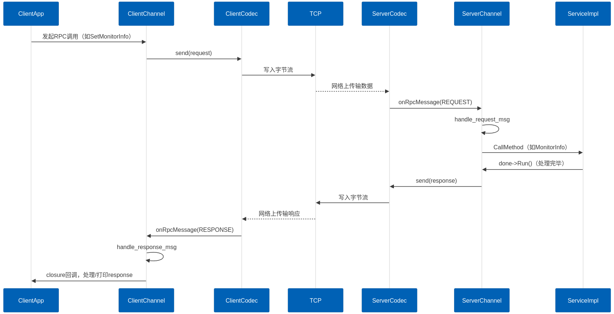
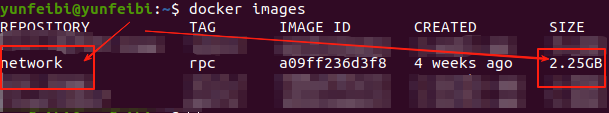

## proto_rpc

### 简介：

一个基于 protobuf 构建的高性能 RPC 框架，采用多 Reactor 多线程模型和回调机制，实现SOA架构下的分布式系统通信

- **SOA架构**：项目遵循SOA设计，**network**，**rpc_framework**，**docker**分为独立的模块，提供特定的功能和接口，便于上层调用和耦合
- **network模块**：基于事件驱动，非阻塞I/O和Reactor模式的网络模块
- **rpc_framework模块**：基于底层network模块，proto编码，反射机制，服务注册与发现等服务，构建高性能RPC框架
- **构建环境自动化**：使用docker构建整个rpc项目环境，通过dockerfile安装protobuf，cmake等依赖项，同时使用Shell编写第三方源码安装和容器操作脚本，以实现项目构建流程的自动化和部署的便利性
- **项目管理和构建**：使用**cmake**作为项目构建系统，并构建相应的静/动态库，供第三方模块调用；并通过git工具，管理仓库代码

整个RPC部分的流程图如下所示：



### 如何运行：

- **下载镜像**

```bash
# 下载镜像
cd my_proto_rpc/docker/build
docker build --network host -t network:rpc -f netwrok_rpc.dockerfile .
```



- **docker容器**

```bash
# 进入docker容器
cd my_proto_rpc/protobuf/docker/scripts
# 启动容器
./rpc_docker)run.sh
# 进入容器
./rpc_docker_into.sh
```

- **编译代码**

```bash
mkdir build
cd build
cmake ..
make-j6
make install
```

- **启动程序**

```bash
# 先启动server，进行监听
cd /build/bin
./protobuf_rpc_server

# 打开新终端，再次进入容器
cd my_proto_rpc/docker/scripts
./rpc_docker_into.sh

# 启动client
cd build/bin
./protobuf_rpc_client localhost
```

